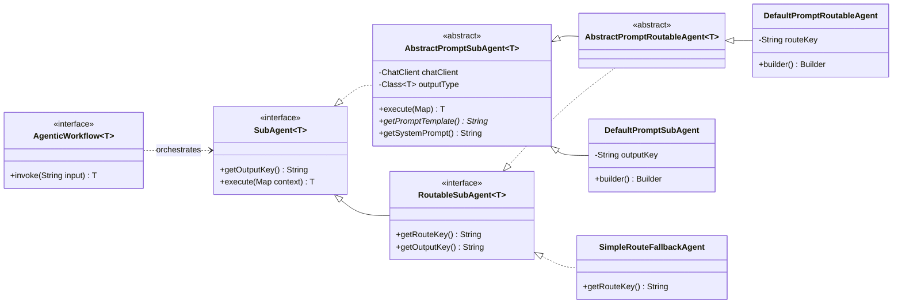
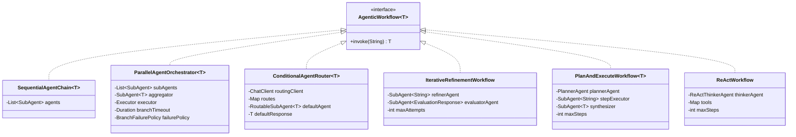
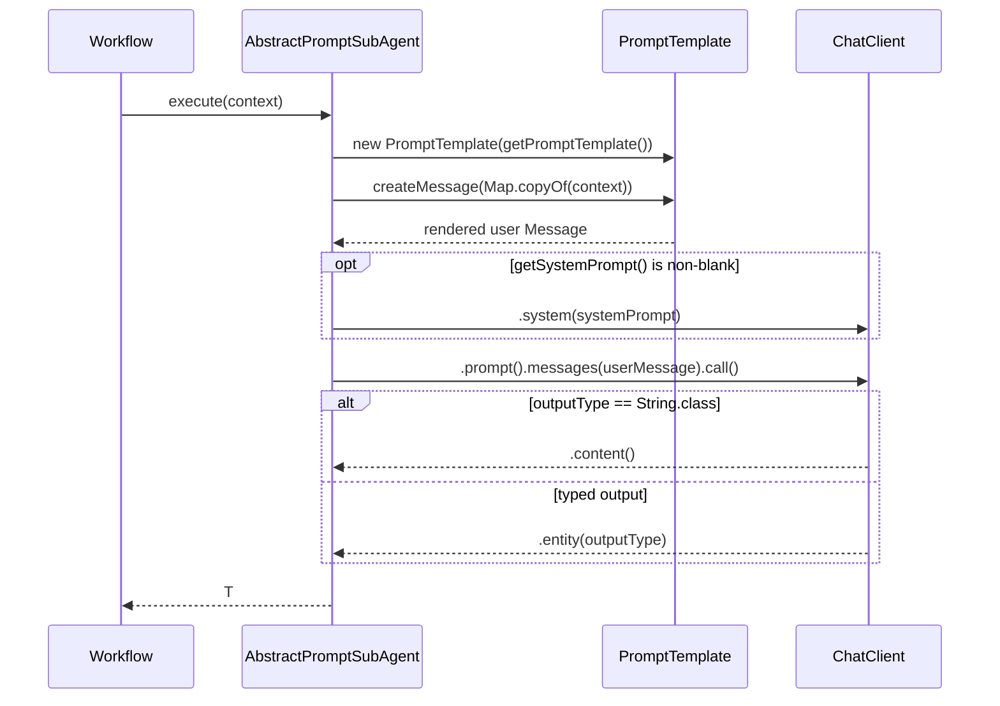
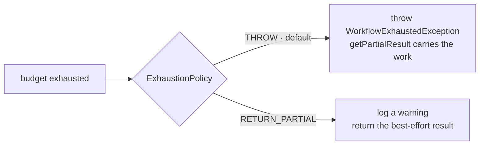

# `:api` — Agentic Workflow Library

Six agentic workflow patterns built on Spring AI. This module is a plain `java-library`: no
Spring Boot plugin, no autoconfiguration, no `main`, and **no model provider** — it compiles
against `spring-ai-client-chat` alone, and the application supplies the provider.

| Guide | Class | Shape |
|---|---|---|
| [Sequential chain](docs/sequential-agent-chain.md) | `SequentialAgentChain<T>` | A → B → C, one shared context |
| [Parallel orchestrator](docs/parallel-agent-orchestrator.md) | `ParallelAgentOrchestrator<T>` | fan-out ⇉ fan-in ⇉ aggregate |
| [Conditional router](docs/conditional-agent-router.md) | `ConditionalAgentRouter<T>` | classify → dispatch → fallback |
| [Iterative refinement](docs/iterative-refinement-workflow.md) | `IterativeRefinementWorkflow` | refine ⇄ evaluate, until PASS |
| [Plan & execute](docs/plan-and-execute-workflow.md) | `PlanAndExecuteWorkflow<T>` | plan → run each step → synthesize |
| [ReAct](docs/react-workflow.md) | `ReActWorkflow` | thought → action → observation |

Each guide covers the architecture, a UML class and sequence diagram, the context keys the
pattern reads and writes, a full implementation walkthrough, and the failure modes.

---

## The core abstractions

Three interfaces carry the whole library.



**`AgenticWorkflow<T>`** — `T invoke(String input)`. One plain-text input, one typed result,
never null. All six patterns implement it, which is what lets you swap one for another, nest
them, or hand one to `AgenticWorkflowAdvisor`.

**`SubAgent<T>`** — one step. `execute(Map<String,String> context)` returns a typed result;
`getOutputKey()` names the context slot the workflow files that result under. A sub-agent is
usually one LLM call, but nothing requires it to be — `SimpleRouteFallbackAgent` is a plain Java
method, and any `AgenticWorkflow` can be wrapped as a `SubAgent` to nest patterns.

**`RoutableSubAgent<T>`** — a `SubAgent` that also answers `getRouteKey()`. Only
`ConditionalAgentRouter` cares. `getOutputKey()` defaults to `null`.

### The workflow implementations



---

## How a prompt sub-agent runs

Everything that talks to a model goes through `AbstractPromptSubAgent.execute`:



Two rules follow from this, and they cause most first-run failures:

1. **Every `{placeholder}` in a template must exist in the context at that point.** Rendering is
   Spring AI's `PromptTemplate`, which fails when a variable has no value. Each pattern guide
   lists exactly which keys are in scope for each agent slot. Extra context entries the template
   ignores are harmless.
2. **A literal `{` in prompt text is a template delimiter.** Asking for JSON output by pasting a
   `{"key": ...}` example into a template will not render. Describe the shape in prose, or use
   typed output (`.entity(...)`) and let Spring AI generate the schema.

Typed output is free: construct `AbstractPromptSubAgent` with a `Class<T>` other than
`String.class` and Spring AI derives a JSON schema from the record, asks the model to conform,
and deserializes. `PlanAndExecuteWorkflow.Plan`, `ReActWorkflow.ReActThought` and the iterative
evaluator's `EvaluationResponse` all work this way.

---

## Context map conventions

Workflows thread state through a `Map<String, String>`. Keys are per-pattern, but the
conventions are stable:

| Key | Meaning | Patterns |
|---|---|---|
| `input` | The original user input. Always present, never overwritten. | all |
| `output` | The previous step's result. | sequential |
| `reports` | Every branch's result, one per line, `KEY: value`. | parallel |
| `route` | The category the classifier picked. | conditional |
| `criteria`, `content`, `feedback` | Refinement loop state. | iterative |
| `plan`, `stepId`, `stepDescription`, `previousResults`, `stepResults` | Plan state. | plan & execute |
| `tools`, `scratchpad` | Tool descriptions and the reasoning trace. | ReAct |
| *your key* | Whatever a `SubAgent` returns from `getOutputKey()`. | sequential, parallel |

---

## Exhaustion: what bounded workflows do when they run out

`ReActWorkflow`, `IterativeRefinementWorkflow` and `PlanAndExecuteWorkflow` are bounded by a step
or attempt budget. All three share one convention, so you learn it once:



The default is `THROW`, because a workflow that ran out of budget did not do what was asked, and
silently returning a half-finished result invites the caller to treat it as a finished one.
Throwing destroys nothing — the partial output rides along on the exception:

```java
try {
    return workflow.invoke(task);
} catch (WorkflowExhaustedException e) {
    log.warn("gave up after {} rounds", e.getLimit());
    return e.getPartialResult();   // may be null
}
```

Choose `RETURN_PARTIAL` when the partial result is genuinely useful on its own — a refinement
draft that never quite passed evaluation, say — and the caller has no better recourse.

`WorkflowExhaustedException` extends `IllegalStateException`, so it is unchecked.

---

## Using a workflow as a Spring AI advisor

`AgenticWorkflowAdvisor` wraps any `AgenticWorkflow<String>` as a Spring AI `BaseAdvisor`. It
runs the workflow on the outgoing user message and appends the result to that message before the
call proceeds down the chain:

```java
ChatClient enriched = chatClient.mutate()
        .defaultAdvisors(new AgenticWorkflowAdvisor(researchWorkflow))
        .build();

String answer = enriched.prompt("What should we do about churn?").call().content();
// the model sees: "What should we do about churn?\n\n<workflow output>"
```

The `before` phase does the work; `after` passes the response through untouched. An empty user
message, or a workflow that returns blank, leaves the request unchanged. The default order is
`Advisor.DEFAULT_CHAT_MEMORY_PRECEDENCE_ORDER + 1` — after the built-in advisors, before custom
ones that do not set an order. Pass an explicit `order` to the two-arg constructor to change it.

Note the cost: the advisor adds a full workflow run to **every** call made through that
`ChatClient`.

---

## Adding a new pattern

1. Implement `AgenticWorkflow<T>` in `com.ronald.agent.workflow`.
2. Take collaborators as `SubAgent<?>`, not `ChatClient`, wherever the caller might want to
   customise the prompt. Reach for `ChatClient` only for a fixed internal agent — see
   `PlanAndExecuteWorkflow.PlannerAgent`.
3. Give it a private constructor and a static `builder()`. Validate in `build()`, not in
   `invoke()`, so misconfiguration fails at wiring time.
4. If it is bounded, honour `ExhaustionPolicy` and throw `WorkflowExhaustedException` carrying
   the partial result. Do not invent a new exhaustion convention.
5. Document the context keys it reads and writes, and add a guide under [`docs/`](docs).
