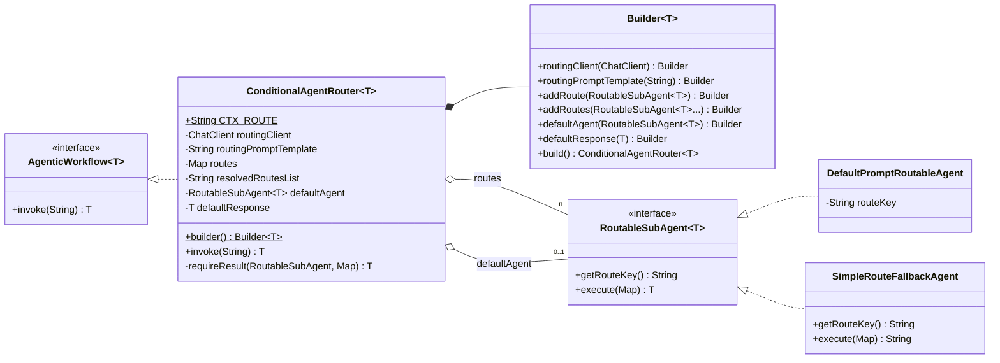
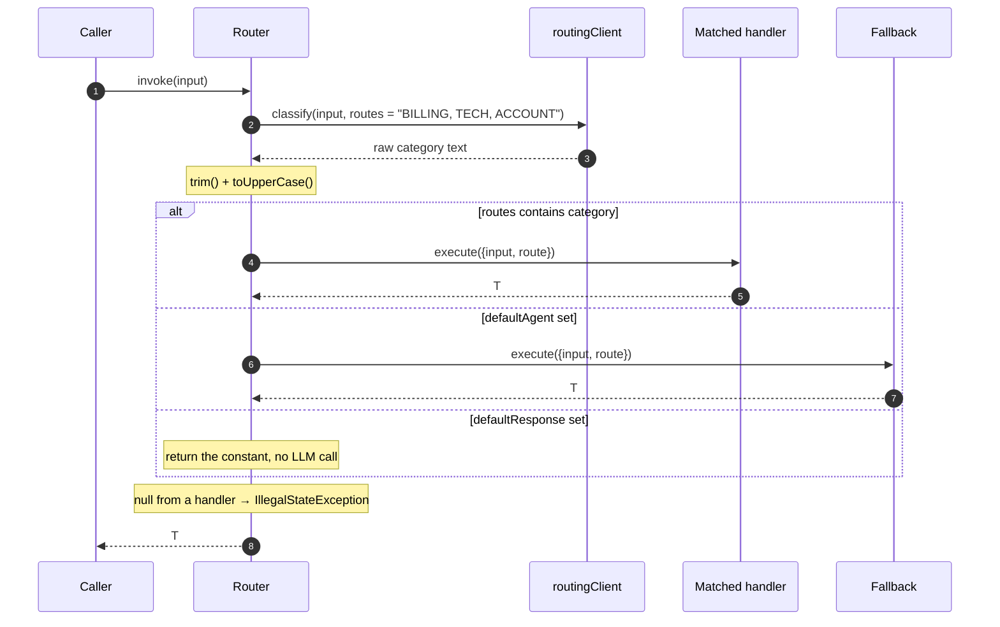

# Conditional router — `ConditionalAgentRouter<T>`

An LLM classifies the input into one of the registered categories, and the matching
`RoutableSubAgent` handles it. Anything unrecognised goes to a mandatory fallback.

**Use it when** requests fall into distinct kinds that deserve different specialists, prompts, or
models — a support desk splitting billing from technical, an intake router, a triage step in
front of an expensive workflow.

**Don't use it when** every branch should run ([parallel](parallel-agent-orchestrator.md)) or
when the categories are decidable with plain code. A `switch` on a regex costs nothing and never
hallucinates a category.

---

## Architecture



Unlike the other patterns, the router holds a `ChatClient` of its own — the classifier is the
workflow's own call, not a `SubAgent`.

### Execution



Exactly one handler runs. The classification call always happens, so the minimum cost is two LLM
calls — unless the fallback is a `defaultResponse` constant or an LLM-free agent, in which case
an unmatched request costs one.

---

## Context keys

The classifier's own template gets:

| Key | Value |
|---|---|
| `input` | The original input. |
| `routes` | The registered route keys, comma-joined, in registration order. |

The dispatched handler — matched or fallback — gets exactly:

| Key | Value |
|---|---|
| `input` | The original input. |
| `route` | The category the classifier returned, upper-cased. Constant: `ConditionalAgentRouter.CTX_ROUTE`. |

Nothing else. A handler template referencing anything but `{input}` and `{route}` fails to
render.

---

## Implementing one

### 1. Write one handler per category

```java
RoutableSubAgent<String> billing = DefaultPromptRoutableAgent.builder()
        .chatClient(chatClient)
        .routeKey("BILLING")
        .systemPrompt("You are a billing expert. Focus only on invoices and refunds.")
        .promptTemplate("Help the user with this billing request: {input}")
        .build();
```

The `routeKey` does double duty: it is the map key the classifier's answer is matched against,
*and* it is what the classifier is shown as a choice. Keys are normalised with `trim()` and
`toUpperCase()` on registration, so `"billing"` and `"BILLING"` register identically.

Choose keys the model can classify into reliably. `BILLING` / `TECH` / `ACCOUNT` works;
`CATEGORY_1` / `CATEGORY_2` does not.

### 2. Provide a fallback — it is mandatory

```java
AgenticWorkflow<String> workflow = ConditionalAgentRouter.<String>builder()
        .routingClient(chatClient)
        .addRoute(billing)
        .addRoute(tech)
        .addRoute(account)
        .defaultAgent(new SimpleRouteFallbackAgent())
        .build();

String reply = workflow.invoke(userInput);
```

`build()` throws unless `defaultAgent` or `defaultResponse` is set. The reasoning is in the code:
the route key comes from free-form LLM output, so no set of routes is ever exhaustive, and
`AgenticWorkflow.invoke` must never return null.

Two shapes of fallback:

```java
.defaultAgent(new SimpleRouteFallbackAgent())     // an agent — can inspect {route}
.defaultResponse("Sorry, I can't help with that.")  // a constant of type T
```

`SimpleRouteFallbackAgent` is a plain Java class that makes **no LLM call** — it reads `{route}`
and returns a formatted apology naming the detected category. Cheap, instant, and a good default.
If both are set, `defaultAgent` wins.

Working end-to-end version:
[`ConditionalWorkflowExample`](../../example/src/main/java/com/ronald/agent/example/ConditionalWorkflowExample.java).

### 3. Optionally replace the classifier prompt

The built-in template is:

```text
Classify the following user request into exactly one of these categories: {routes}.
Respond with only the category name in uppercase, nothing else.
User Request: {input}
Category:
```

Override it when you need per-category descriptions, few-shot examples, or a house style:

```java
.routingPromptTemplate("""
        You are a support-desk triage classifier.

        Categories:
        - BILLING: invoices, charges, refunds, payment methods
        - TECH: crashes, errors, broken features, performance
        - ACCOUNT: login, password reset, profile and permissions

        Choose exactly one of: {routes}
        Answer with the category name alone, uppercase, no punctuation.

        Request: {input}
        """)
```

`build()` verifies the template contains both `{input}` and `{routes}` and throws otherwise.

### Routing to a whole workflow

A handler is a `RoutableSubAgent<T>` — it need not be a single prompt. Wrap a nested workflow to
give one category a heavier machine:

```java
class ResearchRoute implements RoutableSubAgent<String> {
    private final AgenticWorkflow<String> inner;   // e.g. a PlanAndExecuteWorkflow

    @Override public String getRouteKey() { return "RESEARCH"; }

    @Override public String execute(Map<String, String> context) {
        return inner.invoke(context.get("input"));
    }
}
```

This is the cheap-triage-then-expensive-work shape: one small classification call decides whether
to spend a six-step research run.

---

## Builder reference

| Method | Default | Notes |
|---|---|---|
| `routingClient(ChatClient)` | — | Required. Can be a different, cheaper model than the handlers use. |
| `routingPromptTemplate(String)` | built-in | Must contain `{input}` and `{routes}`. |
| `addRoute(RoutableSubAgent<T>)` | — | At least one required. Key is trimmed and upper-cased. |
| `addRoutes(RoutableSubAgent<T>...)` / `(List)` | — | Bulk forms. |
| `defaultAgent(RoutableSubAgent<T>)` | — | Fallback agent. Takes precedence over `defaultResponse`. |
| `defaultResponse(T)` | — | Constant fallback. |
| `build()` | — | Requires a routing client, ≥1 route, valid template, and a fallback. |

### Validation

| Check | Exception |
|---|---|
| No `routingClient` | `NullPointerException` |
| No routes | `IllegalStateException` — "At least one RoutableSubAgent must be added." |
| Template missing `{input}` or `{routes}` | `IllegalStateException` |
| Neither `defaultAgent` nor `defaultResponse` | `IllegalStateException` listing the registered routes |
| `getRouteKey()` returns null | `NullPointerException` at `addRoute` |

---

## Failure modes

| Situation | Result |
|---|---|
| `invoke(null)` | `NullPointerException` |
| Classifier returns something unregistered | Fallback runs — the normal path, not an error |
| Classifier returns null content | Treated as `""`, which matches nothing → fallback |
| Dispatched handler returns `null` | `IllegalStateException` naming the agent and its route key |
| Handler throws | Propagates unchanged |

---

## Gotchas

**Registration order is visible to the model.** `routes` is joined in insertion order
(`LinkedHashMap`), so reordering `addRoute` calls changes the classifier prompt and can change
its answers.

**Matching is exact after normalisation.** The classifier's reply is trimmed and upper-cased,
then looked up. `"Billing"` matches; `"BILLING."`, `"Category: BILLING"`, and
`"I think this is billing"` do not — they all fall through to the fallback. A chatty model is the
most common cause of unexpected fallbacks; tighten the classifier prompt or switch to a model
that follows format instructions more closely.

**The classifier gets no system prompt.** It runs `routingClient.prompt().messages(...)` with the
rendered template only. Put all steering in the template, or pass a `ChatClient` pre-built with
a default system prompt.

**Every request pays for classification.** Two LLM calls minimum on the matched path. Use a
small, fast model for `routingClient` — it only has to emit one word.

**The fallback's `getRouteKey()` is decorative.** `SimpleRouteFallbackAgent` returns `"GENERAL"`,
but a `defaultAgent` is never registered in the route map, so that key is never matched against.

**`defaultResponse` is typed `T`, not `String`.** For a non-`String` router it must be a fully
constructed instance of the result type.
