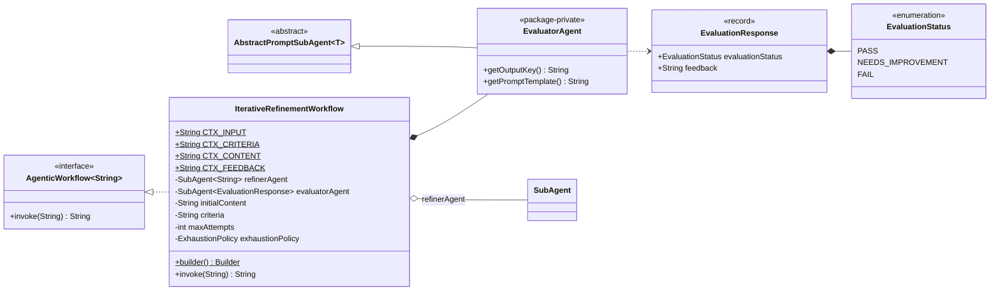
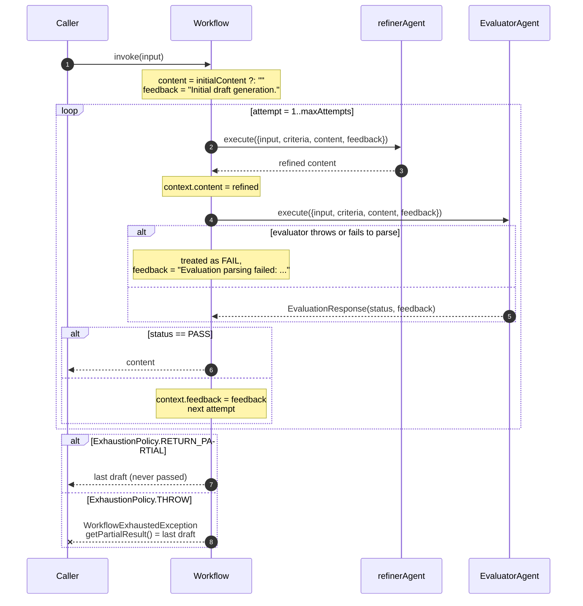

# Iterative refinement — `IterativeRefinementWorkflow`

A refiner improves a draft, an evaluator judges it against explicit criteria, and its feedback
becomes the next round's instructions. The loop exits the moment the evaluator says `PASS`.

**Use it when** quality is judgeable but not reachable in one shot: copy that must hit a tone and
a word count, code that must satisfy a spec, a summary that must cover named points.

**Don't use it when** you cannot write down the criteria. The evaluator is only as good as the
criteria string, and a vague one produces a loop that either passes immediately or never passes.

Note the signature: `IterativeRefinementWorkflow implements AgenticWorkflow<String>` — it is not
generic. The result is always a `String`.

---

## Architecture



The refiner is yours. The evaluator is **built in** — you hand the builder a `ChatClient` and it
constructs the `EvaluatorAgent` for you, with a fixed prompt and typed `EvaluationResponse`
output.

### Execution



**Only `PASS` exits the loop.** `NEEDS_IMPROVEMENT` and `FAIL` are both treated as "go again" —
the enum has three values but the control flow has two.

Each attempt costs **two** LLM calls, so `maxAttempts(7)` is a budget of up to 14 calls.

---

## Context keys

Both the refiner and the evaluator see the same four keys, refreshed each iteration:

| Key | Value | Constant |
|---|---|---|
| `input` | The original task passed to `invoke`. Never changes. | `CTX_INPUT` |
| `criteria` | The criteria string from the builder. Never changes. | `CTX_CRITERIA` |
| `content` | The current draft. `initialContent` (or `""`) on the first pass, then the refiner's latest output. | `CTX_CONTENT` |
| `feedback` | `"Initial draft generation."` on the first pass, then the evaluator's feedback. | `CTX_FEEDBACK` |

The evaluator sees `content` **after** the refiner has updated it, so it always judges the newest
draft.

---

## Implementing one

### 1. Write a refiner that handles both first draft and revision

The same agent runs on every iteration, so its prompt must work when `content` is empty and
`feedback` is the placeholder, *and* when both are real:

```java
DefaultPromptSubAgent refiner = DefaultPromptSubAgent.builder()
        .chatClient(chatClient)
        .outputKey("refinedContent")
        .systemPrompt("""
                You are a storyteller expert specializing in refining children's stories.
                When the current story content exists and there is feedback, refine the story
                to address the feedback and better meet the criteria.
                """)
        .promptTemplate("""
                Original task: {input}
                Current story draft: {content}
                Evaluation feedback: {feedback}

                Focus on making it fun, imaginative, and suitable for children. Keep the story
                concise and ensure it includes all required elements.
                """)
        .build();
```

Telling the model *in the system prompt* how to behave when content and feedback are present is
what makes one agent serve both roles.

### 2. Write criteria the evaluator can check

Criteria go to the built-in evaluator verbatim. Numbered, checkable statements beat adjectives:

```java
String criteria = """
        1. The story features a turtle as the main character on an adventure.
        2. The story has a clear beginning, middle, and end, with a positive moral lesson.
        3. The story is engaging for children: simple language, vivid descriptions, happy ending.
        4. The story is concise, ideally under 250 words.
        """;
```

"Make it good" will never converge. "Under 250 words" will.

### 3. Optionally seed the first draft

```java
String draft = chatClient.prompt(userInput)
        .system("You are a creative storyteller specializing in children's stories.")
        .call().content();
```

Seeding with `initialContent` gives the first refinement something to improve rather than
something to invent. Skip it and `content` starts as `""` — the refiner then writes from scratch
on attempt 1, which works but spends one round doing generation instead of refinement.

### 4. Assemble

```java
IterativeRefinementWorkflow workflow = IterativeRefinementWorkflow.builder()
        .evaluatorAgent(chatClient)          // constructs the built-in EvaluatorAgent
        .refinerAgent(refiner)
        .initialContent(draft)               // optional
        .criteria(criteria)
        .maxAttempts(7)
        .exhaustionPolicy(ExhaustionPolicy.RETURN_PARTIAL)
        .build();

String finalContent = workflow.invoke(userInput);
```

`RETURN_PARTIAL` fits this pattern better than most: a story that never quite passed is still a
story worth reading. Keep the default `THROW` when an unvalidated draft is worse than no draft —
generated code that failed its spec, for instance.

Working end-to-end version:
[`IterativeRefinementWorkflowExample`](../../example/src/main/java/com/ronald/agent/example/IterativeRefinementWorkflowExample.java).

---

## The built-in evaluator

You configure it with `evaluatorAgent(chatClient)` and it does the rest. Its prompt asks for a
typed `EvaluationResponse` and explains the three statuses:

| Status | Meaning per the prompt | Loop effect |
|---|---|---|
| `PASS` | All criteria met, no improvements needed. | **Exits** and returns the current draft. |
| `NEEDS_IMPROVEMENT` | Some criteria met, room to improve. | Another round. |
| `FAIL` | Criteria not met, or off-topic. | Another round. |

The `feedback` field carries the reasoning and, when the status is not `PASS`, concrete
suggestions — which land in `{feedback}` for the next refinement.

To evaluate differently — a different rubric, a stricter model, a non-LLM check — you cannot
replace it through the builder: `evaluatorAgent` accepts only a `ChatClient`. Build the loop
yourself, or shape the judgement through `criteria`.

---

## Builder reference

| Method | Default | Notes |
|---|---|---|
| `refinerAgent(SubAgent<String>)` | — | Required. |
| `evaluatorAgent(ChatClient)` | — | Required. Takes a client, not an agent — it constructs the built-in evaluator. |
| `criteria(String)` | — | Required; `null` throws `IllegalArgumentException`. |
| `initialContent(String)` | `null` → `""` | Optional seed draft. |
| `maxAttempts(int)` | `5` | Must be ≥ 1. Each attempt = 2 LLM calls. |
| `exhaustionPolicy(ExhaustionPolicy)` | `THROW` | See [exhaustion](../README.md#exhaustion-what-bounded-workflows-do-when-they-run-out). |

### Validation

| Check | Exception |
|---|---|
| No `refinerAgent` | `IllegalStateException` — "refinerAgent must be provided" |
| No `evaluatorAgent` | `IllegalStateException` — "evaluatorAgent must be provided" |
| `maxAttempts < 1` | `IllegalArgumentException` |
| `criteria == null` | `IllegalArgumentException` |

---

## Failure modes

| Situation | Result |
|---|---|
| Evaluator throws or its output won't deserialize | Logged at `WARN`, treated as `FAIL`, feedback becomes `"Evaluation parsing failed: ..."`, loop continues |
| Refiner throws | Propagates — the refiner is **not** wrapped in a try/catch |
| No `PASS` within `maxAttempts` | `WorkflowExhaustedException` (`THROW`) or the last draft (`RETURN_PARTIAL`) |
| Refiner returns `null` | Stored as-is; the next `Map.copyOf` on the context throws `NullPointerException` |

The asymmetry is deliberate: a flaky *evaluator* shouldn't sink a run that is otherwise
progressing, and its failure has a sensible interpretation ("we couldn't confirm this passes").
A failed *refiner* leaves nothing to iterate on.

---

## Gotchas

**`invoke(input)` does not null-check.** Unlike the other workflows, there is no
`Objects.requireNonNull` on the input. A null input becomes a null `{input}` value and blows up
in `Map.copyOf` during rendering.

**`initialContent` is fixed at build time, not per invocation.** The workflow instance carries
one seed draft. To refine different documents, build a workflow per document — the builders are
cheap.

**A rejected draft is not remembered.** Each round sees only the *latest* draft and the *latest*
feedback. The model can and does oscillate between two drafts across attempts. Criteria that pin
down concrete, cumulative properties reduce this.

**`RETURN_PARTIAL` returns content that failed evaluation.** It is logged at `WARN`, but the
return type is the same `String` a passing run produces — there is no flag on the value saying so.
If the caller must distinguish, use `THROW` and catch.

**Cost scales at two calls per attempt.** `maxAttempts(7)` is up to 14 model calls for one
`invoke`. Start at 3 while tuning prompts.
