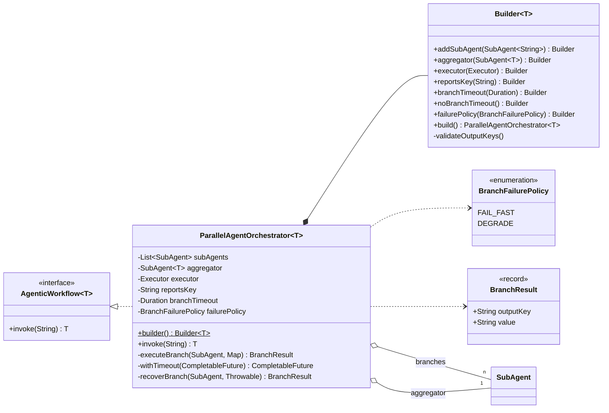
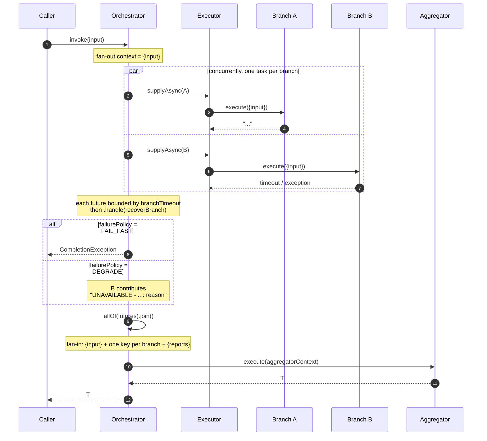

# Parallel orchestrator — `ParallelAgentOrchestrator<T>`

Independent agents run concurrently on the same input (fan-out), their results are collected into
one context (fan-in), and a single aggregator agent turns that context into the final answer.

**Use it when** several analyses of the same input don't depend on each other: sentiment +
safety + translation, or three reviewers of one document, or the same question asked of
different specialists.

**Don't use it when** a branch needs another branch's output — that's
[sequential](sequential-agent-chain.md).

---

## Architecture



The aggregator is a `SubAgent<T>` — strongly typed, unlike the branches, which must all return
`String`. That is where the workflow's result type comes from.

### Execution



Each branch is bounded and recovered *independently*, before the join. One slow agent cannot hang
the workflow, and one failing agent does not have to discard its siblings' completed work.

---

## Context keys

**Branches** receive exactly one key:

| Key | Value |
|---|---|
| `input` | The original `invoke` argument. |

That is the whole map. A branch template referencing anything else fails to render — branches
cannot see each other, by construction.

**The aggregator** receives:

| Key | Value |
|---|---|
| `input` | The original input again. |
| *each branch's `outputKey`* | That branch's result verbatim. |
| `reports` | Every branch joined by newlines as `OUTPUTKEY: value`, key upper-cased. Rename with `reportsKey(...)`. |

`reports` and the individual keys are both populated, always. Use `{reports}` when the aggregator
should treat branches uniformly; use `{sentiment}`, `{safety}` when the prompt needs to address
them by name. Mixing both duplicates content in the prompt — pick one.

---

## Implementing one

### 1. Write each branch against `{input}` alone

```java
DefaultPromptSubAgent sentiment = DefaultPromptSubAgent.builder()
        .chatClient(chatClient)
        .outputKey("sentiment")
        .systemPrompt("You are a sentiment analyzer. Be concise.")
        .promptTemplate("""
                Analyze the sentiment of the following text. Classify as POSITIVE, NEUTRAL,
                or NEGATIVE, and briefly explain why.
                Text: {input}
                """)
        .build();
```

Every branch needs a **unique, non-blank** `outputKey` that is neither `input` nor the reports
key. `build()` enforces this — see [Validation](#validation) below.

### 2. Write the aggregator against the fanned-in keys

```java
DefaultPromptSubAgent aggregator = DefaultPromptSubAgent.builder()
        .chatClient(chatClient)
        .systemPrompt("""
                You are a Senior Content Analyst. Synthesize reports from multiple specialists
                into one professional executive summary. Resolve contradictions, highlight
                critical safety warnings, and be concise.
                """)
        .promptTemplate("""
                Original Text:
                {input}

                Specialist Reports:
                {reports}

                Produce a final cohesive report covering sentiment, safety, and translation.
                """)
        .build();
```

### 3. Supply an `Executor` and assemble

```java
AgenticWorkflow<String> workflow = ParallelAgentOrchestrator.<String>builder()
        .addSubAgent(sentiment)
        .addSubAgent(safety)
        .addSubAgent(translation)
        .aggregator(aggregator)
        .executor(executor)
        .build();

String report = workflow.invoke(text);
```

The executor is mandatory — the orchestrator will not silently pick `ForkJoinPool.commonPool()`.
On Java 21, virtual threads make branch count essentially free:

```java
@Bean
public Executor executor() {
    return Executors.newVirtualThreadPerTaskExecutor();
}
```

Branches are I/O-bound HTTP calls, so a virtual-thread-per-task executor scales to hundreds of
concurrent branches without pool sizing. Swap in `Executors.newFixedThreadPool(n)` when you need
to cap concurrency against a rate-limited provider instead.

Working end-to-end version:
[`ParallelWorkflowExample`](../../example/src/main/java/com/ronald/agent/example/ParallelWorkflowExample.java).

---

## Timeouts and failure policy

```java
ParallelAgentOrchestrator.<String>builder()
        .branchTimeout(Duration.ofSeconds(30))
        .failurePolicy(BranchFailurePolicy.DEGRADE)
        // ...
        .build();
```

**`branchTimeout`** defaults to 60 seconds and applies per branch. `Duration.ZERO` — or the
explicit `noBranchTimeout()` — waits forever.

> The timeout bounds **how long the workflow waits, not how long the agent runs.**
> `CompletableFuture.orTimeout` completes the *future* exceptionally; it cannot interrupt an
> in-flight HTTP call. The provider request runs to completion and its response is discarded.
> You are still billed for it.

**`failurePolicy`** decides what a failed or timed-out branch does to the run:

| Policy | Behaviour |
|---|---|
| `FAIL_FAST` *(default)* | The whole workflow aborts with a `CompletionException` naming the branch, its agent class, and the cause. Matches a plain `allOf(...).join()`. |
| `DEGRADE` | The branch contributes `UNAVAILABLE - this analysis did not complete: <reason>` under its own key, and the aggregator runs with every key present. |

`DEGRADE` is deliberate about the gap rather than hiding it: the aggregator still receives the
key, so the prompt can reason about the missing analysis instead of quietly omitting a section.
It suits reports where three of four sections still beat nothing. Keep `FAIL_FAST` when a missing
branch would make the aggregate wrong rather than merely thinner — a safety check, for instance.

---

## Builder reference

| Method | Default | Notes |
|---|---|---|
| `addSubAgent(SubAgent<String>)` | — | At least one required. |
| `addSubAgents(SubAgent<String>...)` / `(List)` | — | Bulk forms; the varargs form is unchecked. |
| `aggregator(SubAgent<T>)` | — | Required. Sets the workflow's result type. |
| `executor(Executor)` | — | Required. |
| `reportsKey(String)` | `"reports"` | Rename the combined-report key. Becomes reserved. |
| `branchTimeout(Duration)` | 60s | Per branch. `ZERO` = unbounded. Negative throws. |
| `noBranchTimeout()` | — | Shorthand for `branchTimeout(Duration.ZERO)`. |
| `failurePolicy(BranchFailurePolicy)` | `FAIL_FAST` | |

### Validation

`build()` rejects a misconfigured orchestrator up front:

| Check | Exception |
|---|---|
| No sub-agents | `IllegalStateException` — "SubAgents required." |
| No aggregator / no executor | `NullPointerException` |
| A branch `outputKey` is null or blank | `IllegalStateException` naming the agent class |
| A branch key equals `input` or the reports key | `IllegalStateException` — reserved key |
| Two branches share a key | `IllegalStateException` — duplicate key |

The duplicate check matters more than it looks: fan-in writes into a map, so a collision would
silently overwrite a completed branch's result with no error at all. Catching it at build time
turns a class of invisible data loss into a wiring error.

---

## Failure modes

| Situation | Result |
|---|---|
| `invoke(null)` | `NullPointerException` |
| A branch returns `null` | `NullPointerException` inside the branch, then handled by the failure policy |
| A branch throws or times out | `CompletionException` (`FAIL_FAST`) or a placeholder value (`DEGRADE`) |
| The aggregator throws | Propagates — the aggregator is not covered by the branch policy |
| Executor rejects a task | Surfaces as a branch failure and follows the policy |

---

## Gotchas

**Branches are blind to each other.** The fan-out context is `Map.of("input", input)` — a
literal one-entry map. If branch B needs branch A's output, this is the wrong pattern.

**All branches must return `String`.** Only the aggregator is typed. `addSubAgent` takes
`SubAgent<String>` and the fan-in stores raw strings.

**Fan-in order follows declaration order, not completion order.** The `reports` string is built
by iterating the futures in the order the agents were added, so output is deterministic even
though execution is not.

**`DEGRADE` still charges you.** A timed-out branch's request completes at the provider. The
timeout caps latency, not spend.

**The aggregator is a serial tail.** *n* branches cost roughly one branch's latency, but the
aggregator call still runs afterwards. Total ≈ slowest branch + aggregator.

**Every branch sends the full input.** *n* branches means *n* copies of the input in prompt
tokens. Wide fan-out over a large document gets expensive quickly.
