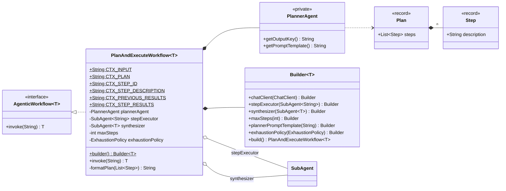
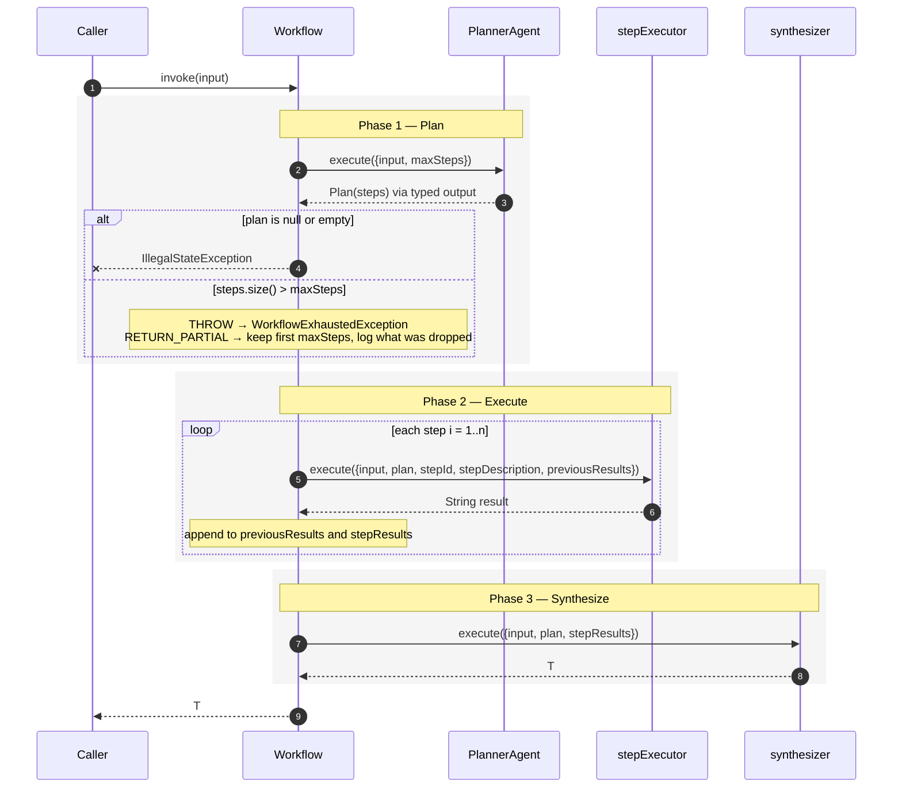

# Plan & execute — `PlanAndExecuteWorkflow<T>`

A planner decomposes the task into an ordered list of steps. A step executor runs each step in
turn, seeing everything the earlier steps produced. A synthesizer folds all the results into one
typed answer.

**Use it when** the work is open-ended enough that you cannot hard-code the stages, but ordered
enough that a plan is worth making: research reports, multi-part analyses, "investigate X and
write it up".

**Don't use it when** the stages are known in advance — a [sequential chain](sequential-agent-chain.md)
does that with one fewer LLM call and no planning risk — or when the next action depends on what
the last one *observed*, which is [ReAct](react-workflow.md).

The difference from ReAct in one line: **the plan is fixed before execution starts.** Steps can
read earlier results, but the step list itself never changes.

---

## Architecture



The planner is internal — you supply a `ChatClient` and, optionally, a prompt template. The step
executor and synthesizer are yours.

### Execution



Cost is `1 + n + 1` LLM calls for an *n*-step plan — plan, each step, synthesis.

---

## Context keys

**Planner** (internal):

| Key | Value |
|---|---|
| `input` | The original task. |
| `maxSteps` | The configured budget, as a string — the default template asks for "between 2 and {maxSteps} steps". |

**Step executor**, fresh on every step:

| Key | Value | Constant |
|---|---|---|
| `input` | The original task. | `CTX_INPUT` |
| `plan` | The whole plan, formatted `1. …\n2. …`. | `CTX_PLAN` |
| `stepId` | Current step number, 1-based, as a string. | `CTX_STEP_ID` |
| `stepDescription` | This step's description. | `CTX_STEP_DESCRIPTION` |
| `previousResults` | All earlier results, as `Step N: <result>` blocks. Empty on step 1. | `CTX_PREVIOUS_RESULTS` |

**Synthesizer**, once at the end:

| Key | Value | Constant |
|---|---|---|
| `input` | The original task. | `CTX_INPUT` |
| `plan` | The formatted plan. | `CTX_PLAN` |
| `stepResults` | Every result labelled `Step N — <description>:` then the text. | `CTX_STEP_RESULTS` |

`previousResults` and `stepResults` are two views of the same work: the terse one for executing,
the labelled one for writing up.

---

## Implementing one

### 1. Write a step executor that is told which step it is on

One agent runs every step, so its prompt must orient itself from the context:

```java
DefaultPromptSubAgent stepExecutor = DefaultPromptSubAgent.builder()
        .chatClient(chatClient)
        .outputKey("stepResult")
        .systemPrompt("""
                You are a knowledgeable research specialist executing one step of a structured
                research plan. Focus exclusively on the current step. Use insights from previous
                steps where relevant. Be thorough, factual, and concise.
                """)
        .promptTemplate("""
                Research task: {input}

                Full plan:
                {plan}

                Results from previous steps:
                {previousResults}

                Current step {stepId}: {stepDescription}

                Execute this step thoroughly and provide a detailed, well-structured response.
                """)
        .build();
```

"Focus exclusively on the current step" earns its place — without it, a model handed the full
plan tends to answer the whole task on step 1 and then repeat itself.

### 2. Write a synthesizer

```java
DefaultPromptSubAgent synthesizer = DefaultPromptSubAgent.builder()
        .chatClient(chatClient)
        .systemPrompt("""
                You are an expert analyst producing a final research report. Synthesize all step
                results into a cohesive, well-structured report. Eliminate redundancy, resolve
                contradictions, and highlight key insights.
                """)
        .promptTemplate("""
                Research task: {input}

                Plan that was executed:
                {plan}

                Step-by-step research results:
                {stepResults}

                Produce a comprehensive final report with clear sections, key findings,
                and a concise summary.
                """)
        .build();
```

This is the slot that types the workflow. `SubAgent<T>` here means `PlanAndExecuteWorkflow<T>`
returns `T` — and unlike the sequential chain, the builder really does accept a typed agent:

```java
// typed output: the synthesizer returns a record, not a String
class ReportSynthesizer extends AbstractPromptSubAgent<Report> {
    ReportSynthesizer(ChatClient c) { super(c, Report.class); }
    @Override public String getOutputKey() { return null; }
    @Override public String getPromptTemplate() { return "..."; }
}

PlanAndExecuteWorkflow<Report> workflow = PlanAndExecuteWorkflow.<Report>builder()
        .synthesizer(new ReportSynthesizer(chatClient))
        // ...
        .build();
```

### 3. Assemble

```java
AgenticWorkflow<String> workflow = PlanAndExecuteWorkflow.<String>builder()
        .chatClient(chatClient)        // used by the internal planner
        .stepExecutor(stepExecutor)
        .synthesizer(synthesizer)
        .maxSteps(6)
        .build();

String report = workflow.invoke(topic);
```

Working end-to-end version:
[`PlanAndExecuteWorkflowExample`](../../example/src/main/java/com/ronald/agent/example/PlanAndExecuteWorkflowExample.java).

### 4. Optionally steer the planner

The default template asks for concrete, ordered, independently executable steps that build on
each other, between 2 and `maxSteps` of them. Override it to constrain the shape of plans:

```java
.plannerPromptTemplate("""
        Decompose this engineering task into an ordered list of steps.

        Rules:
        - Every step must be verifiable by reading code or running a test.
        - No step may require information from a later step.
        - Produce between 3 and {maxSteps} steps.

        Task: {input}
        """)
```

Keep both `{input}` and `{maxSteps}` — the default template uses them and the planner has no
other way to learn the budget. (Unlike the conditional router, this is not validated at build
time; a template missing `{maxSteps}` simply renders without it, and the plan may overrun.)

The planner returns typed output: Spring AI derives a schema from the `Plan(List<Step>)` record
and deserializes the model's JSON into it. You do not describe the output format in the prompt.

---

## The step budget

`maxSteps` is both a hint to the planner and a hard cap on execution — and the two can disagree.
When the planner returns more steps than the budget:

| Policy | Behaviour |
|---|---|
| `THROW` *(default)* | `WorkflowExhaustedException`; `getPartialResult()` is the **full formatted plan** that could not be run, `getLimit()` is `maxSteps`. Nothing executes, so nothing is spent beyond the planning call. |
| `RETURN_PARTIAL` | Executes the first `maxSteps` steps, logs a `WARN` naming how many were dropped, and synthesizes from what ran. |

The default is strict for a specific reason spelled out in the code: truncating silently would
hand the synthesizer a partial plan and let it present an incomplete report as a complete one.
The failure is visible instead.

`RETURN_PARTIAL` is reasonable when the plan is front-loaded — the important work happens early
and the tail is polish. It is a bad idea when step *n* is the conclusion.

---

## Builder reference

| Method | Default | Notes |
|---|---|---|
| `chatClient(ChatClient)` | — | Required. Used **only** by the internal planner. |
| `stepExecutor(SubAgent<String>)` | — | Required. Must return `String`. |
| `synthesizer(SubAgent<T>)` | — | Required. Types the workflow. |
| `maxSteps(int)` | `10` | Must be ≥ 1. Caps both the plan and execution. |
| `plannerPromptTemplate(String)` | built-in | Should contain `{input}` and `{maxSteps}`. |
| `exhaustionPolicy(ExhaustionPolicy)` | `THROW` | Applies to an over-budget plan. |

### Validation

| Check | Exception |
|---|---|
| Missing `chatClient`, `stepExecutor`, or `synthesizer` | `NullPointerException` |
| `maxSteps < 1` | `IllegalArgumentException` |
| Planner returns null / empty plan | `IllegalStateException` at invoke time, naming the input |
| Plan longer than `maxSteps` under `THROW` | `WorkflowExhaustedException` |

---

## Failure modes

| Situation | Result |
|---|---|
| `invoke(null)` | `NullPointerException` |
| Planner output won't deserialize into `Plan` | Propagates from Spring AI's structured-output conversion |
| Empty plan | `IllegalStateException` — "Planner produced an empty plan for input: …" |
| A step throws | Propagates immediately; earlier steps' work is lost |
| Synthesizer throws | Propagates; every step has already been paid for |

There is no per-step retry and no partial synthesis on a mid-run failure. A step that fails at
*n* of 6 discards the *n−1* completed steps. If a step is flaky, put the retry inside the
`stepExecutor` agent.

---

## Gotchas

**Every step gets the whole plan and every previous result.** `previousResults` grows on each
iteration, so prompt tokens grow roughly quadratically across a run. A 10-step plan over verbose
steps can get expensive; keep the executor's output disciplined ("be concise" is doing real work
in that system prompt).

**The plan is fixed once made.** A step that discovers the plan was wrong has no way to revise
it. That is the trade against ReAct — cheaper and more predictable, less adaptive.

**A bad plan is unrecoverable.** Planning is one LLM call with no validation beyond "non-empty"
and the step count. Everything downstream inherits its mistakes. When plans come out poorly
shaped, fix `plannerPromptTemplate` before touching the executor.

**`maxSteps` is advisory to the planner.** It arrives as a prompt variable; models overshoot. The
budget check exists precisely because the hint is not binding.

**`stepId` is a `String`.** The context is `Map<String,String>` — it's `"1"`, `"2"`, not an int.

**The step executor's `outputKey` is unused.** Results are accumulated into `previousResults` and
`stepResults` by position, not by key. Setting it is harmless.
