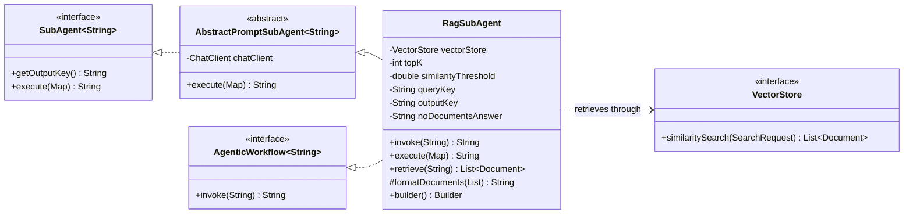
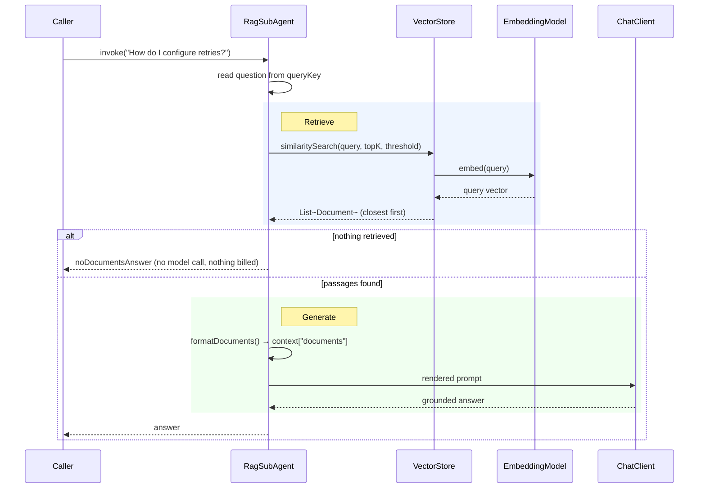

# RAG — `RagSubAgent`

Retrieval-augmented generation in one agent. The question is embedded and used to semantic-search
a `VectorStore`; the passages that come back are rendered into the prompt; the model answers from
them and nothing else.

**Use it when** the answer lives in a corpus the model was never trained on — your docs, your
tickets, your contracts — and you want the answer to cite that corpus rather than the model's
memory.

**Don't use it when** the model already knows the answer (you are paying for an embedding call
and a bigger prompt to tell it what it knows), or when the question needs *reasoning across*
retrievals rather than one lookup. For the latter, give a [ReAct](react-workflow.md) loop a
retrieval tool so it can search, read, and search again.

`RagSubAgent` is the only class here that implements **both** interfaces:

```java
public class RagSubAgent extends AbstractPromptSubAgent<String>
        implements AgenticWorkflow<String>
```

so it answers directly through `invoke(String)` *and* drops into any workflow in this library as
one `SubAgent` step. It names no store implementation — it compiles against the `VectorStore`
interface, exactly as the rest of the library compiles against `ChatClient` without naming a
model provider.

---

## Architecture



### Execution



The empty branch is the part worth noticing: with no passages there is nothing for an answer to
be grounded in, so calling the model would buy a guess dressed up as a citation. The agent
returns `noDocumentsAnswer` instead and logs at `WARN`.

---

## Context keys

| Key | Direction | Value | Constant |
|---|---|---|---|
| `input` | read | The question. Renamed via `queryKey(...)`. | `CTX_INPUT` |
| `documents` | **written** | The formatted passage block, added before the prompt renders. | `CTX_DOCUMENTS` |
| `output` | published | The answer, under `getOutputKey()`. Renamed via `outputKey(...)`. | `DEFAULT_OUTPUT_KEY` |

`documents` is written into a *copy* of the caller's context, so an immutable map passed to
`execute` stays valid and upstream keys stay visible to the template. Passages are formatted as:

```text
[1] source=retry.md, score=0.820
Retries are configured per client, not globally.

[2] source=config.md, score=0.710
The default is ten attempts.
```

The number is what the model cites. `source` comes from the document's `source` metadata, falling
back to its id; `score` is omitted entirely when the store did not set one.

---

## Implementing one

### 1. Supply a store

`:api` names no store. The application picks one and exposes it as a `VectorStore` bean — Chroma,
in `:example`:

```java
@Bean
public VectorStore chromaVectorStore(ChromaApi api, EmbeddingModel embeddingModel) {
    return ChromaVectorStore.builder(api, embeddingModel)
            .tenantName("SpringAiTenant")
            .databaseName("SpringAiDatabase")
            .collectionName("chroma-doc")
            .initializeSchema(true)
            .build();
}
```

### 2. Build the agent

```java
RagSubAgent agent = RagSubAgent.builder()
        .chatClient(chatClient)
        .vectorStore(vectorStore)
        .topK(4)
        .similarityThreshold(0.5)
        .build();

String answer = agent.invoke("How do I configure retries?");
```

### 3. Or compose it into a workflow

As a `SubAgent` it reads `queryKey` and writes `outputKey`, so a chain can retrieve first and
write from the passages second:

```java
SequentialAgentChain.<String>builder()
        .agent(RagSubAgent.builder()
                .chatClient(chatClient)
                .vectorStore(vectorStore)
                .outputKey("evidence")
                .build())
        .agent(DefaultPromptSubAgent.builder()
                .chatClient(chatClient)
                .promptTemplate("Write a release note from this evidence:\n{evidence}")
                .outputKey("output")
                .build())
        .build();
```

When the question arrives under another name, set `queryKey` **and** match the template
placeholder — the prompt renders straight from the context map, so `queryKey("topic")` needs
`{topic}` in the template.

### 4. Show your sources

`retrieve(String)` runs the search alone. It exists so callers can display sources, or check
whether the corpus can answer at all, without paying for a generation to find out:

```java
List<Document> passages = agent.retrieve(question);   // no LLM call
```

---

## The prompt contract

The built-in template constrains the model to the passages:

```text
- Ground every claim in the passages. Do not draw on outside knowledge.
- If the passages do not contain the answer, say so plainly rather than guessing.
- Cite the passages you used by their bracketed number, like [1].
```

Override with `promptTemplate(...)`, keeping `{documents}` and the placeholder named by
`queryKey`. Unlike the other agents here the template is **optional** — leaving it unset uses the
built-in one.

The instructions are the only thing stopping the model answering from memory. They are
instructions, not enforcement: a model that recognises the question will sometimes answer from
training data and cite a passage that does not support it. Checking that is on the caller, which
is what `retrieve(...)` is for.

---

## Builder reference

| Method | Default | Notes |
|---|---|---|
| `chatClient(ChatClient)` | — | Required, for the generation step. |
| `vectorStore(VectorStore)` | — | Required, for the retrieval step. |
| `topK(int)` | `4` | Must be ≥ 1. Every passage lands in the prompt in full — this is the main cost lever. |
| `similarityThreshold(double)` | `0.0` | 0.0–1.0. `0.0` accepts everything the store returns. |
| `queryKey(String)` | `"input"` | Must be non-blank, and must match the template placeholder. |
| `outputKey(String)` | `"output"` | Where the answer is published in a workflow. |
| `noDocumentsAnswer(String)` | `"(no relevant passages found)"` | Returned *instead of* calling the model. |
| `promptTemplate(String)` | built-in | Optional. Should contain `{documents}` and the `queryKey` placeholder. |
| `systemPrompt(String)` | `null` | |

### Validation

| Check | Exception |
|---|---|
| No `chatClient` | `NullPointerException` |
| No `vectorStore` | `NullPointerException` |
| Null `queryKey` or `noDocumentsAnswer` | `NullPointerException` |
| Blank `queryKey` | `IllegalArgumentException` — "queryKey must not be blank" |
| `topK < 1` | `IllegalArgumentException` |
| `similarityThreshold` outside 0.0–1.0 | `IllegalArgumentException` |

---

## Failure modes

| Situation | Result |
|---|---|
| `invoke(null)` | `NullPointerException` |
| `execute(context)` with no entry under `queryKey` | `NullPointerException` naming the key |
| Retrieval returns empty | `noDocumentsAnswer`, logged at `WARN`. No model call. |
| Retrieval returns `null` | Treated as empty — same path |
| Store unreachable | Propagates out of `invoke`; the run ends |
| Embedding model rejects the query | Propagates from inside `similaritySearch` |
| Retrieved passages are irrelevant | **Not** an error — the model is told to say the passages do not answer the question |

There is one budget here and it is not a step count: this pattern makes exactly one embedding
call and at most one chat call per question, so it has nothing to exhaust and no
`ExhaustionPolicy`.

---

## Gotchas

**The embedding model is part of the index, not the query.** Passages were stored as vectors
produced by one model; the query is embedded by whatever model is wired in now. Change it — a
different provider, or just `text-embedding-3-small` to `-3-large` — and the two vector spaces
stop being comparable. Nothing fails. Retrieval keeps returning its `topK` nearest neighbours,
they are simply no longer related to the question. This is the least visible way to break a RAG
pipeline, and no amount of prompt tuning will fix it.

**A similarity threshold is corpus-specific.** The default `0.0` accepts everything, which is
permissive on purpose: what counts as a good floor depends on the embedding model *and* the
corpus, so a number that works in one deployment is meaningless in another. Measure it against
your own data before raising it — set it too high and you get the no-documents answer for
questions the corpus does answer.

**`topK` is the token bill.** Each passage is rendered whole into the prompt. Four medium
passages is a very different request from twenty, and the retrieval cost barely moves — it is the
prompt that grows.

**An empty collection looks exactly like a bad question.** Both produce the no-documents answer.
When wiring this up, check the collection is populated first; `:example` calls
`RagSubAgentExample.documentCount()` before asking anything, precisely so the two cases are
distinguishable.

**Retrieval is one shot.** The question you were given is the question that gets embedded — there
is no query rewriting, no HyDE, no multi-hop. A question phrased unlike the corpus retrieves
poorly. Rewrite the query upstream (a `SequentialAgentChain` step is enough) if that bites.
