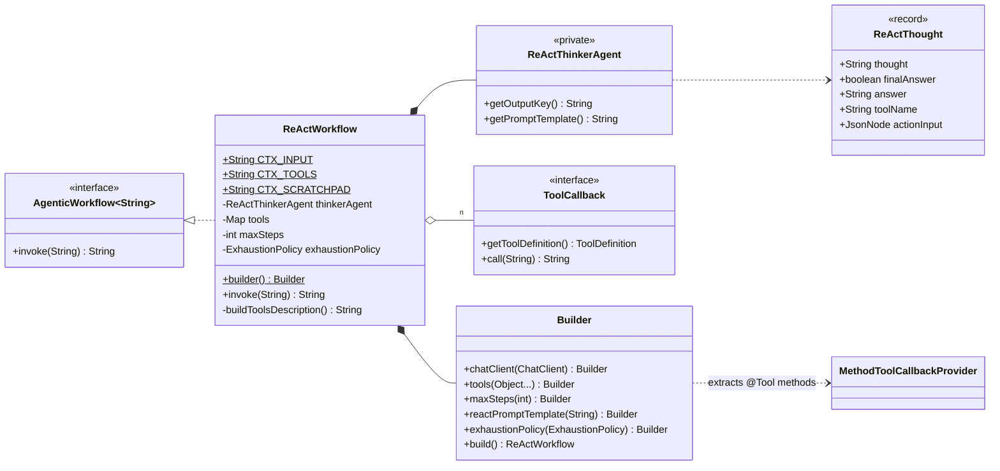
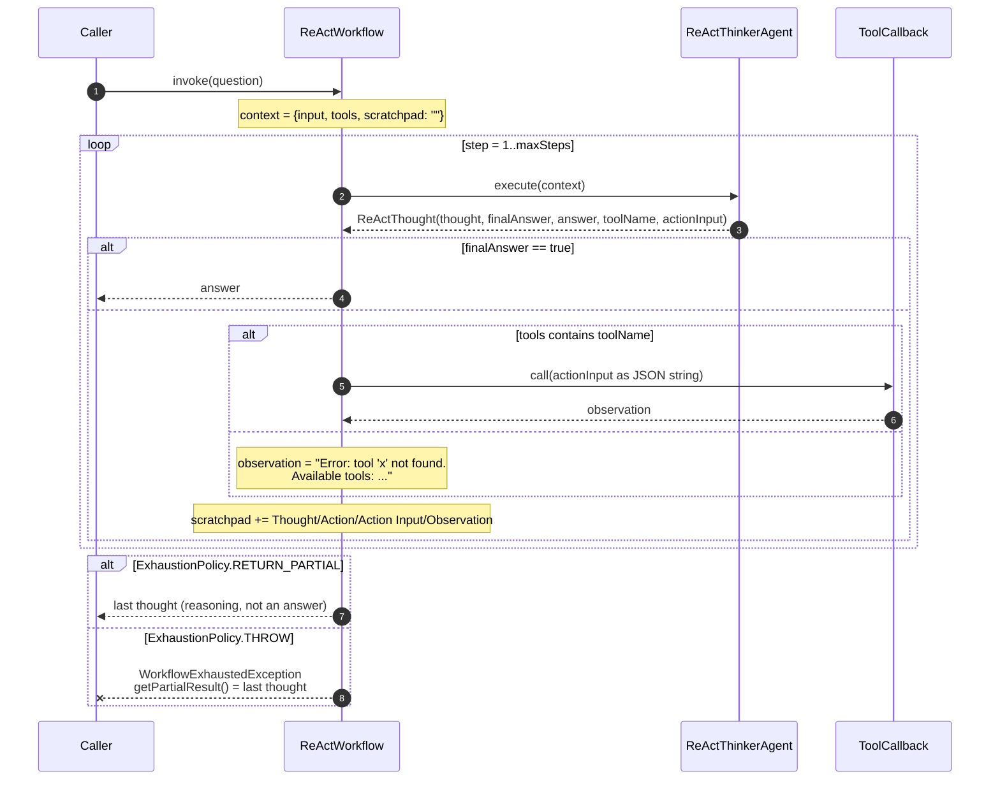
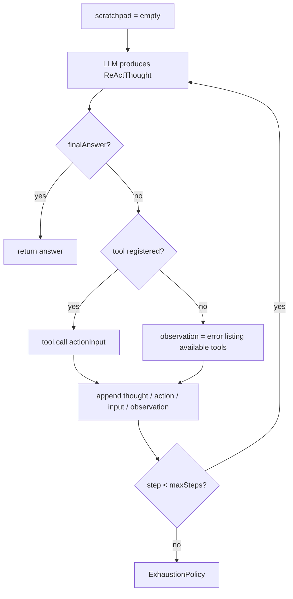

# ReAct — `ReActWorkflow`

Reasoning and acting, interleaved. The model states a **thought**, names an **action** (a tool
and its arguments), and reads the **observation** the tool returned. That trace accumulates in a
scratchpad and feeds the next round, until the model declares it has the answer.

**Use it when** the next step genuinely depends on what the last one found: looking something up
and then deciding what to look up next, debugging, anything where a fixed plan would be guessing.

**Don't use it when** the sequence is knowable up front. [Plan & execute](plan-and-execute-workflow.md)
is cheaper and far more predictable; a [sequential chain](sequential-agent-chain.md) cheaper still.

Like the iterative workflow, this one is not generic: `ReActWorkflow implements
AgenticWorkflow<String>`.

---

## Architecture



### Execution



The loop shape:



One LLM call per step, plus local tool calls, which are usually free. `maxSteps(8)` means up to
8 model calls.

---

## Context keys

| Key | Value | Constant |
|---|---|---|
| `input` | The user's question. Fixed. | `CTX_INPUT` |
| `tools` | Every registered tool as `- name: description (input schema: {…})`, generated from the `@Tool` annotations. Fixed. | `CTX_TOOLS` |
| `scratchpad` | The growing trace. Empty on step 1. | `CTX_SCRATCHPAD` |

Scratchpad entries are appended in this shape:

```text
Thought: I need to count the words in the quote.
Action: wordCount
Action Input: {"text":"Four score and seven years ago..."}
Observation: 17 words, 96 characters

```

---

## How tools work here

`ReActWorkflow` **calls tools itself.** It does not hand them to the `ChatClient`, so Spring AI's
native tool-calling never runs. The workflow:

1. extracts `ToolCallback`s from your `@Tool`-annotated methods via `MethodToolCallbackProvider`;
2. renders their names, descriptions and JSON input schemas into `{tools}` in the prompt;
3. asks the model, as **typed output**, for a `ReActThought` naming a tool and an `actionInput`;
4. invokes `toolCallback.call(actionInputAsJson)` and appends the returned string.

The consequence: the model never sees a tool-use API, only a text description of what's
available, and the loop is fully visible and debuggable at `DEBUG`. If you want the provider's
own tool-calling instead, use a plain `ChatClient` with `.tools(...)` — not this workflow.

`actionInput` is typed `JsonNode` rather than `Map` or `String` on purpose: Jackson can
deserialize both an object and an explicit `null` into it without erroring, and the model is
instructed to send `null` on the final step.

---

## Implementing one

### 1. Write tools as annotated methods

Any object with `@Tool` methods works — a `@Service`, a helper, or the class holding the workflow:

```java
@Tool(description = "Counts the number of words and characters in the given text.")
public String wordCount(
        @ToolParam(description = "the text to count words in") String text) {
    if (text == null || text.isBlank()) {
        return "0 words, 0 characters";
    }
    int words = text.trim().split("\\s+").length;
    return words + " words, " + text.length() + " characters";
}

@Tool(description = "Converts a value between common units of measurement. "
        + "Supported conversions: celsius_to_fahrenheit, fahrenheit_to_celsius, "
        + "km_to_miles, miles_to_km.")
public String unitConverter(
        @ToolParam(description = "conversion type: celsius_to_fahrenheit, fahrenheit_to_celsius, "
                + "km_to_miles, or miles_to_km") String conversion,
        @ToolParam(description = "the numeric value to convert") double value) {
    return switch (conversion.trim().toLowerCase()) {
        case "celsius_to_fahrenheit" -> String.format("%.2f °F", value * 9.0 / 5.0 + 32);
        // ...
        default -> "Unknown conversion '" + conversion + "'. Supported: celsius_to_fahrenheit, ...";
    };
}
```

Three rules that decide whether the loop works at all:

- **The `description` is the entire API contract.** It is all the model gets. `unitConverter`
  enumerates its supported conversions in the description precisely so the model picks a valid
  one on the first try.
- **Return a `String` that reads as an observation.** It goes into the scratchpad verbatim and
  becomes the model's evidence. `"37.00 °F"` is usable; `"true"` is not.
- **Handle bad input by returning an explanation, not by throwing.** The `default ->` branch
  returns the list of supported values, which lets the model correct itself next round. A thrown
  exception propagates out of `invoke` and ends the run.

### 2. Register and invoke

```java
ReActWorkflow workflow = ReActWorkflow.builder()
        .chatClient(chatClient)
        .tools(this)        // any object(s) with @Tool methods
        .maxSteps(8)
        .build();

String answer = workflow.invoke(question);
```

`tools(Object...)` takes several sources; callbacks are keyed by tool name, so a later
registration with the same name replaces the earlier one.

Working end-to-end version:
[`ReActWorkflowExample`](../../example/src/main/java/com/ronald/agent/example/ReActWorkflowExample.java).

### 3. Watch it think

```properties
logging.level.com.ronald.agent=DEBUG
```

Every step logs its thought, the tool called, and the observation — the fastest way to see why a
loop is not converging.

---

## The prompt contract

The built-in template hands the model a strict protocol:

```text
- Set "thought" to your reasoning about what to do next.
- Set "finalAnswer" to true ONLY when you have gathered enough information to fully
  answer the question.
- When "finalAnswer" is true: provide the complete answer in "answer" and set "toolName"
  and "actionInput" to null.
- When "finalAnswer" is false: set "toolName" to the exact tool name, set "actionInput" to
  a JSON object matching the tool's input schema, and set "answer" to null.
```

Override it with `reactPromptTemplate(...)` — keeping `{input}`, `{tools}` and `{scratchpad}` —
when you need domain framing or a stricter stopping rule. Keep the field semantics: `invoke`
branches on `finalAnswer` and reads `answer`, `toolName`, and `actionInput` exactly as described.

---

## Builder reference

| Method | Default | Notes |
|---|---|---|
| `chatClient(ChatClient)` | — | Required. Every reasoning step uses it. |
| `tools(Object...)` | — | At least one `@Tool` method required. |
| `maxSteps(int)` | `10` | Must be ≥ 1. One LLM call per step. |
| `reactPromptTemplate(String)` | built-in | Should contain `{input}`, `{tools}`, `{scratchpad}`. |
| `exhaustionPolicy(ExhaustionPolicy)` | `THROW` | |

### Validation

| Check | Exception |
|---|---|
| No `chatClient` | `NullPointerException` |
| No tools registered | `IllegalArgumentException` — "At least one @Tool-annotated method must be registered" |
| `maxSteps < 1` | `IllegalArgumentException` |

---

## Failure modes

| Situation | Result |
|---|---|
| `invoke(null)` | `NullPointerException` |
| Model names an unregistered tool | **Not** an error — the observation lists the available tools and the loop continues |
| A tool throws | Propagates out of `invoke`; the run ends |
| Model output won't deserialize into `ReActThought` | Propagates from structured-output conversion |
| `finalAnswer=true` with a null `answer` | Returned as `null`, breaking the never-null contract of `AgenticWorkflow` |
| No final answer within `maxSteps` | `WorkflowExhaustedException` (`THROW`) or the last *thought* (`RETURN_PARTIAL`) |

The unknown-tool case is the interesting one: it is self-correcting by design. The model asked
for something that does not exist, is told what does, and tries again — at the cost of one step
from the budget.

---

## Gotchas

**`RETURN_PARTIAL` returns a thought, not an answer.** The last `thought` field is mid-reasoning
text like "I still need to check the date" — grammatically a sentence, semantically not a
response. It is logged at `WARN` for exactly that reason. Prefer `THROW` here and decide in the
catch block; this is the pattern where the partial result is least useful on its own.

**The scratchpad grows every step.** It is resent in full on each call, so an 8-step run's last
prompt carries all seven prior thoughts, actions, and observations. Verbose tool output is paid
for repeatedly — keep observations tight.

**A loop can burn its budget on repetition.** Nothing detects a model calling the same tool with
the same arguments over and over. `maxSteps` is the only backstop, which is why the default
policy is to fail loudly rather than return whatever it was mumbling.

**Tool exceptions are not contained.** Unlike the unknown-tool path, a tool that throws kills the
run. Catch inside the tool method and return the error as text if you want the model to recover.

**No conversation memory across steps.** State lives entirely in the rendered scratchpad — each
call is stateless from the provider's side. Anything the model needs to remember must appear in a
thought or an observation.

**`getOutputKey()` on the thinker returns `"thought"` but is never read.** The workflow drives the
agent directly rather than filing results into a shared context.
