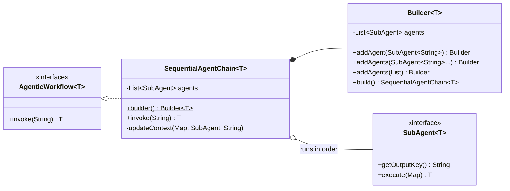
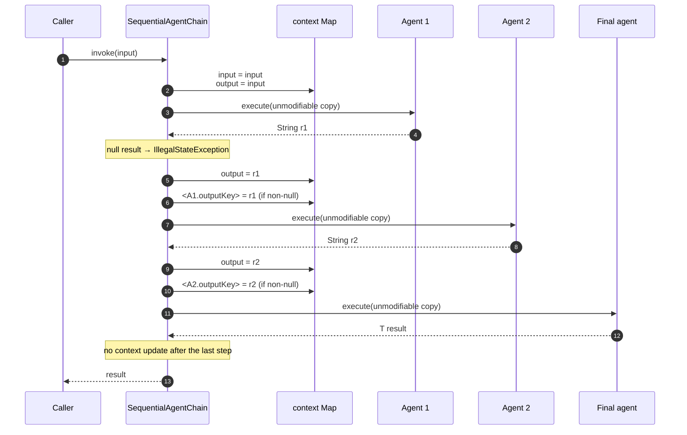

# Sequential chain — `SequentialAgentChain<T>`

Agents run one after another. Each one's output is filed into a shared context map that every
later agent can read.

**Use it when** the task decomposes into ordered stages where each stage needs the previous
one's work: summarise → classify → draft, extract → validate → format, translate → localise →
proofread.

**Don't use it when** the stages are independent — that is
[parallel](parallel-agent-orchestrator.md) — or when only one branch should run, which is
[conditional](conditional-agent-router.md).

---

## Architecture



The chain owns no `ChatClient`. It is pure orchestration over a `List<SubAgent<?>>`; every model
call belongs to an agent.

### Execution



Every agent but the last is an *intermediate*: its result is cast to `String` and written back to
the context. The last agent's result is returned as `T` and never written anywhere.

---

## Context keys

Seeded before the first agent runs:

| Key | Value |
|---|---|
| `input` | The original `invoke` argument. Never overwritten. |
| `output` | Also the original input at the start, then the previous step's result. |

After each intermediate step, the chain writes:

- `output` — always
- the agent's `getOutputKey()` — only when it is non-null

**Templates can only reference keys that already exist.** The first agent sees `{input}` and
`{output}`. The second additionally sees whatever the first agent named. Referencing a later
step's key from an earlier agent fails at render time, not at build time.

---

## Implementing one

### 1. Define each step as a `SubAgent`

`DefaultPromptSubAgent` covers the common case — a prompt template, an optional system prompt,
and a name for the result:

```java
DefaultPromptSubAgent summarize = DefaultPromptSubAgent.builder()
        .chatClient(chatClient)
        .outputKey("summary")
        .promptTemplate("Summarize the following support request into 3 bullet points: {input}")
        .build();
```

`outputKey` is the contract with downstream steps: it declares the name later templates use.
Pick it before you write the next prompt.

### 2. Have each step read what the previous one produced

```java
DefaultPromptSubAgent categorize = DefaultPromptSubAgent.builder()
        .chatClient(chatClient)
        .outputKey("category")
        .promptTemplate("""
                Based on this summary, identify the department (Billing, Tech, or Account):

                {summary}

                Return only the department name, nothing else.
                """)
        .build();
```

`{summary}` resolves because the previous agent declared `outputKey("summary")`. A step may
read any earlier key, not just the immediately preceding one — plus `{input}` and `{output}`.

### 3. Make the last agent the one that produces the answer

```java
DefaultPromptSubAgent reply = DefaultPromptSubAgent.builder()
        .chatClient(chatClient)
        // no outputKey — nothing reads this step's result but the caller
        .systemPrompt("You are a helpful customer support agent.")
        .promptTemplate("""
                The user sent this complaint: {input}
                Our internal summary is: {summary}
                This has been routed to the {category} department.

                Draft a friendly response to the user letting them know we are working on it.
                """)
        .build();
```

Omit `outputKey` on the final step. Nothing reads it — the chain returns its result directly.

### 4. Assemble and invoke

```java
AgenticWorkflow<String> workflow = SequentialAgentChain.<String>builder()
        .addAgents(summarize, categorize, reply)   // order is the execution order
        .build();

String answer = workflow.invoke(userComplaint);
```

Working end-to-end version:
[`SequentialWorkflowExample`](../../example/src/main/java/com/ronald/agent/example/SequentialWorkflowExample.java).

### Custom step behaviour

When a step needs logic a prompt template cannot express — a database lookup, a deterministic
transform, a nested workflow — implement `SubAgent<String>` directly:

```java
class LookupAgent implements SubAgent<String> {
    @Override public String getOutputKey() { return "accountTier"; }

    @Override public String execute(Map<String, String> context) {
        return accountService.tierFor(context.get("customerId"));   // no LLM call
    }
}
```

It slots into the chain exactly like a prompt agent. To subclass the prompt machinery instead —
for a dynamic template, say — extend `AbstractPromptSubAgent<String>` and implement
`getPromptTemplate()`.

---

## Builder reference

| Method | Required | Notes |
|---|---|---|
| `addAgent(SubAgent<String>)` | at least one | Appends one step. |
| `addAgents(SubAgent<String>...)` | — | Varargs. Generic-array creation makes this call unchecked; the warning is expected. |
| `addAgents(List<? extends SubAgent<String>>)` | — | Type-safe alternative to the varargs form. |
| `build()` | — | Throws `IllegalStateException` if no agents were added. |

---

## Failure modes

| Situation | Result |
|---|---|
| `invoke(null)` | `NullPointerException` — "input must not be null" |
| An intermediate agent returns `null` | `IllegalStateException` — "Agent returned null at step *i*" |
| Template references a key not yet in context | Render-time failure from Spring AI's `PromptTemplate` |
| `build()` with no agents | `IllegalStateException` |
| The final agent returns `null` | Returned as-is — the null check covers intermediates only |

A failure anywhere aborts the chain. There is no retry, no skip, and no partial result: the cost
of the steps that already ran is spent. If a step is flaky, handle it inside that `SubAgent`.

---

## Gotchas

**The last agent's `outputKey` is ignored.** Context is updated only after intermediate steps.
Setting `outputKey` on the final agent is harmless but does nothing.

**A one-agent chain has no intermediates.** With a single agent, that agent *is* the final step —
it runs once and its result is returned without touching the context.

**Intermediate results are cast to `String`.** The chain does an unchecked
`(String) agent.execute(...)`. An intermediate agent with a non-`String` output type compiles but
throws `ClassCastException` at runtime. Only the final agent may be typed.

**`T` other than `String` needs care.** `Builder.addAgent` accepts `SubAgent<String>`, so a
typed final agent cannot be added through the fluent API without an unchecked cast, even though
`invoke` casts its result to `T`. In practice `SequentialAgentChain<String>` is the usable form;
for a typed final result, prefer [Plan & Execute](plan-and-execute-workflow.md), whose
synthesizer slot is properly typed `SubAgent<T>`.

**Agents see an unmodifiable view.** A `SubAgent` cannot write to the context directly. The only
way to publish a value is to return it and declare an `outputKey`.

**Cost is linear and unbounded.** *n* agents means *n* sequential LLM calls, each waiting for the
last. Latency adds up; there is no step budget to cap it.
